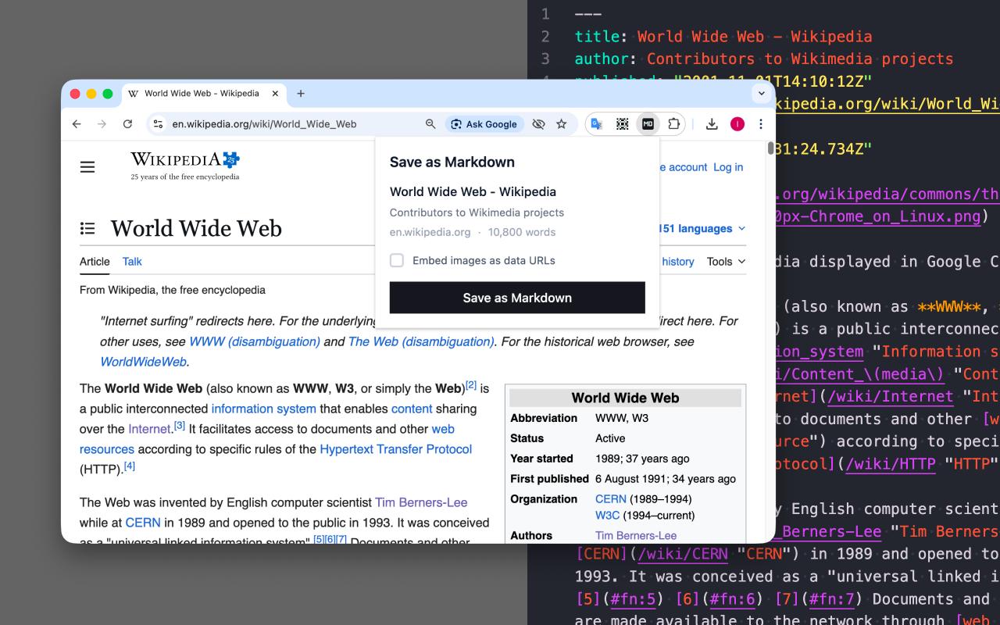

<a href="https://chromewebstore.google.com/detail/save-html-as-markdown/fecbffppkniebokpogicppegfladcdad">
  
</a>
<a href="https://addons.mozilla.org/en-US/firefox/addon/save-html-as-markdown/">
  
</a>
</br>

# Save HTML as Markdown

A browser extension that saves any webpage as a clean Markdown file with YAML frontmatter.

## Features

- **One-click save** — click the toolbar icon, hit save, get a `.md` file
- **Smart extraction** — strips navigation, ads, and sidebars using [Defuddle](https://github.com/kepano/defuddle) to capture only the main content
- **YAML frontmatter** — title, author, publish date, description, source URL, site name, and saved timestamp
- **GFM support** — tables, strikethrough, and task lists via [turndown-plugin-gfm](https://github.com/mixmark-io/turndown-plugin-gfm)
- **Image embedding** — optionally embed images as base64 data URLs for fully offline Markdown files
- **Page preview** — popup shows title, author, domain, and word count before saving
- **Cross-browser** — Chrome and Firefox

## Output Format

Files are saved as `{page-title}.md` with the following structure:

```markdown
---
title: Some Article Title
author: Jane Doe
published: 2026-01-15
description: A short summary of the article
source: https://example.com/article
site: example.com
saved: 2026-02-20T01:05:29.000Z
---

# Article Heading

The article content converted to Markdown...
```

Markdown conversion uses ATX-style headings (`#`), fenced code blocks (`` ``` ``), `-` bullet lists, `**` bold, `*` italic, and inlined links.

## Build from Source

### Requirements

- **OS**: macOS, Linux, or Windows
- **Node.js**: v22 or later — [install](https://nodejs.org/)
- **pnpm**: v10 or later — `npm install -g pnpm` after installing Node.js

### Steps

```sh
# 1. Install dependencies
pnpm install

# 2. Build the extension
pnpm build              # Chrome (Manifest V3)
pnpm build:firefox      # Firefox (Manifest V2)
```

Build output is written to:

- `.output/chrome-mv3/` — Chrome build
- `.output/firefox-mv2/` — Firefox build

### Load the Extension

**Chrome**: Go to `chrome://extensions`, enable "Developer mode", click "Load unpacked", and select `.output/chrome-mv3`.

**Firefox**: Go to `about:debugging#/runtime/this-firefox`, click "Load Temporary Add-on", and select any file inside `.output/firefox-mv2`.

### Third-Party Libraries

All third-party libraries are open source and installed via pnpm from the npm registry. No vendored or modified copies are included. Source code for each library can be found at:

| Library | Source |
|---|---|
| [Defuddle](https://www.npmjs.com/package/defuddle) | https://github.com/kepano/defuddle |
| [Turndown](https://www.npmjs.com/package/turndown) | https://github.com/mixmark-io/turndown |
| [turndown-plugin-gfm](https://www.npmjs.com/package/turndown-plugin-gfm) | https://github.com/mixmark-io/turndown-plugin-gfm |
| [comctx](https://www.npmjs.com/package/comctx) | https://github.com/molvqingtai/comctx |
| [React](https://www.npmjs.com/package/react) | https://github.com/facebook/react |
| [WXT](https://www.npmjs.com/package/wxt) | https://github.com/wxt-dev/wxt |
| [Tailwind CSS](https://www.npmjs.com/package/tailwindcss) | https://github.com/tailwindlabs/tailwindcss |

## Development

```sh
pnpm install
pnpm dev          # Chrome with hot reload
pnpm dev:firefox  # Firefox with hot reload
```

## How It Works

```
popup/App.tsx          Click "Save as Markdown"
       |
       v
content.ts             Extracts page content via Defuddle
  lib/extractor.ts     Parses HTML into structured metadata
  lib/converter.ts     Converts HTML to Markdown via Turndown
  lib/frontmatter.ts   Generates YAML frontmatter from metadata
  lib/filename.ts      Sanitizes page title into a safe filename
       |
       v
background.ts          Handles file download + image fetching
  lib/download-service.ts   Triggers browser download
  lib/image-service.ts      Fetches and base64-encodes images (optional)
```

Services communicate between content script, background, and popup through [comctx](https://www.npmjs.com/package/comctx) proxies.

## Permissions

| Permission | Reason |
|---|---|
| `activeTab` | Read the current page's HTML for conversion |
| `downloads` | Save the generated Markdown file |

## Tech Stack

WXT, React 19, TypeScript, Tailwind CSS v4, Turndown, Defuddle, comctx